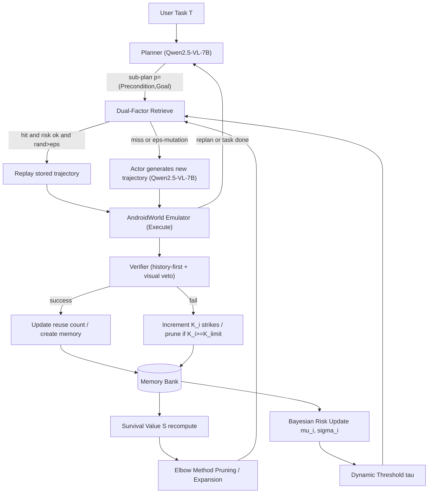

# DMS (Darwinian Memory System) 算法复现工程计划

## 已确认的关键决策
- 评测规模：覆盖全部 20 个 AndroidWorld App，每个 App 采样 1-2 个任务（约 25-30 个任务），每个任务跑 5 轮（round/trial），memory 跨轮持续演化，用于画出 SR / Token-Step / Memory Size 的进化曲线。
- VLM 部署：本地用 vLLM 在其中一块 RTX 4090 上部署 `Qwen2.5-VL-7B-Instruct`，通过 OpenAI 兼容接口调用。
- 已确认本机具备：KVM（模拟器加速）、Docker、96 核/503G 内存、7×24G显存GPU、可访问 GitHub/HuggingFace，磁盘剩余约 302G——满足全部实验需求，无阻塞性硬件限制。

## 论文核心公式（已从 arXiv:2601.22528 原文提取，将严格照此实现）

**Survival Value（生存价值，每个 memory unit 的核心打分）：**

```
U(n_i)  = ln(1 + n_i) + V_new                         # 边际效用 + 新记忆保护期加成
D(Δt,n_i) = 1 / (1 + exp(β(Δt - T_half(n_i))))         # 自适应时间衰减（Sigmoid）
T_half(n_i) = T_base + μ · ln(1 + n_i)                 # 半衰期随使用次数对数增长
P(K_i) = 1 / (1 + γ·K_i)                               # 可靠性惩罚（K_i=累计验证失败次数）
S(m_i) = U(n_i) · D(Δt, n_i) · P(K_i)
```

论文 Appendix B 给出的默认超参（作为初始配置）：`V_new=1.0, T_base=30.0, μ(longevity)=15.0, β=0.5, γ=1.0, λ=0.3, K_limit=3`。

**Dual-Factor 检索：** `Score(p̂,p) = sim(φ(p̂_pre),φ(p_pre)) · sim(φ(p̂_goal),φ(p_goal))`，用轻量本地文本 embedding 模型（如 `bge-small-zh/en` 或 `gte-small`）实现 `φ`。

**Elbow Method 动态剪枝：** 对按 `S` 排序后的曲线 `f(k)`，取二阶差分最大点 `k* = argmax ∇²f(k)` 作为截断点；若 `f(k*) ≥ mean(f)` 则不剪枝反而扩容 `C_min ← min(C_min+Δstep, C_max)`。

**Bayesian 风险反馈：** `μ_i=(F_i+α)/(F_i+S_i+α+β)`，`σ_i=sqrt(μ_i(1-μ_i)/(F_i+S_i+α+β+1))`，风险分 `T_i=μ_i-σ_i`（Lower Confidence Bound），动态阈值 `τ=τ_base·(1-λ·T_global)`，`T_i>τ` 则该 sub-plan 被抑制。

**ε-Mutation：** 以概率 `ε` 放弃复用、重新生成轨迹；若新轨迹成功且更短（`|τ'|<|τ|`），触发原地演化替换。

论文 **Algorithm 1**（Verification Loop）给出了完整的 Planner→Retrieve/Generate→Execute→Verify→更新 Survival/Risk 的主循环伪代码，将作为 `src/androidworld_integration/dms_agent_adapter.py` 主循环的直接实现蓝本。

## 系统架构



## 目录结构（新建于 `/home/uuy/home/DWS`）

- `paper/` — 论文 PDF 与关键公式摘录（已下载至 `/tmp/dms_research/dms_paper.pdf`，会正式归档）
- `configs/dms_config.yaml` — 全部超参数（S 公式、风险模型、剪枝阈值 `C_min/C_max`）
- `scripts/setup_androidworld.sh` — 安装 Android cmdline-tools、下载系统镜像、创建 AVD、headless 启动模拟器（`-no-window -grpc 8554`，KVM 加速）
- `scripts/serve_vlm.sh` — 用 vLLM 启动 `Qwen2.5-VL-7B-Instruct` OpenAI 兼容服务
- `scripts/run_eval.sh` — 一键运行选定任务集 × 3 条件（BaselineA/B/DMS）× 5 round，支持多模拟器并行与断点续跑
- `src/vlm/qwen_vl_client.py` — 封装对本地 vLLM 服务的多模态调用
- `src/agent/planner.py` / `src/agent/actor.py` / `src/agent/verifier.py` — Planner-Actor-Verifier 三个角色，Prompt 基本复用论文 Appendix H 思路但独立实现
- `src/memory/memory_bank.py` — `MemoryUnit = (p, τ, s_meta)`，磁盘持久化轨迹 + 向量索引
- `src/memory/survival.py` — `S(m_i)` 及三个子项的实现
- `src/memory/pruning.py` — Elbow method + 扩容逻辑
- `src/memory/risk.py` — Bayesian 声誉模型 + 动态阈值
- `src/memory/mutation.py` — ε-mutation + 演化替换
- `src/baselines/zero_shot_agent.py` — Baseline A（无记忆）
- `src/baselines/static_memory_agent.py` — Baseline B（只追加不修剪）
- `src/androidworld_integration/dms_agent_adapter.py` — 继承 AndroidWorld `EnvironmentInteractingAgent`，实现 `step()`，串联上述模块（对应 Algorithm 1 主循环）
- `src/eval/metrics.py` — SR / SRR（成功保持率）/ MRR（记忆复用率）/ 平均 Token 与步数 / Memory Size 曲线
- `src/eval/plots.py` — 生成交付物要求的全部图表
- `results/` — 原始日志、指标 CSV、图表
- `report/README.md` — 复现技术报告（机制映射表、指标对比图、Gap 分析）

## 任务集选取方法（tier2：20 App × 1-2 任务）

从 AndroidWorld `android_world/task_evals` 注册表中按 App 分组，每个 App 挑 1-2 个任务，优先选择：
- 覆盖 Easy/Medium/Hard 不同难度
- 至少包含 2-3 个长序列/组合任务（`composite` 目录下），用于体现分层记忆与跨 sub-task 复用的价值
最终清单会在 `configs/task_suite.yaml` 中显式列出，并在报告中说明抽样理由。

## 实验协议

- 3 条件：Baseline A（zero-shot 无记忆）、Baseline B（静态追加记忆不做修剪）、DMS（完整实现）。
- 每条件对已选任务集跑 5 轮（round），memory 跨轮持续保留演化（不重置），每轮内每个任务用随机化参数重新实例化一次。
- 并行化：为控制真实模拟器交互总耗时，使用多个 headless 模拟器实例并行跑不同任务（初步计划 4-6 个实例，vLLM 单点服务并发处理请求），实际并行度将在实现阶段根据吞吐测试调整。
- 记录：每个 episode 的成功/失败、耗时、步数、token 消耗、memory 命中/复用轨迹长度、memory bank 大小快照。

## 交付物落地对应

- **机制映射**：报告中明确指出 `src/memory/survival.py`＝Survival Value，`src/memory/pruning.py`＝Elbow剪枝，`src/memory/risk.py`＝反馈调节。
- **核心指标图表**：Success Rate 按 round 演化曲线（3 条件对比）、Token/步数随 round 下降趋势、Memory Size 随时间变化曲线——均由 `src/eval/plots.py` 生成。
- **Gap 分析**：在报告中讨论 7B vs 论文 72B 的能力差距（如更容易产生错误的 sub-plan、UI grounding 误差），说明如何通过强化 Actor Prompt 的“STRICT LITERAL EXECUTION / ANTI-OVERREACH”规则、更保守的验证阈值等方式部分弥补。

## 实施步骤（Todos，按顺序推进）

1. 环境搭建：安装 Android cmdline-tools + 创建/启动 headless AVD（验证 ADB 连接）；并行搭建 vLLM 服务加载 Qwen2.5-VL-7B-Instruct，验证多模态请求可用。
2. 跑通 AndroidWorld 官方 `minimal_task_runner.py` + 官方 M3A agent，确认基础环境无误。
3. 实现 Planner-Actor 基线 agent（`PA-Lite`），接入 `EnvironmentInteractingAgent` 接口，先不带任何记忆，作为 Baseline A。
4. 实现分层记忆核心结构（MemoryUnit、磁盘存储、Dual-Factor 检索索引）。
5. 实现 Survival Value 计算与 Elbow 动态剪枝（含扩容安全阀）。
6. 实现 Bayesian 风险评估与动态阈值反馈抑制。
7. 实现 ε-mutation 与原地演化替换，完整拼装成 DMS 主循环（对照 Algorithm 1）。
8. 实现 Baseline B（静态追加记忆，无修剪/无风险机制）。
9. 编写多轮并行评测编排脚本 + 指标采集（SR/SRR/MRR/Token/Steps/MemorySize）。
10. 跑完整实验矩阵（3 条件 × ~25-30 任务 × 5 round），生成图表。
11. 撰写复现技术报告（机制映射、指标图、Gap 分析），整理最终交付包。

